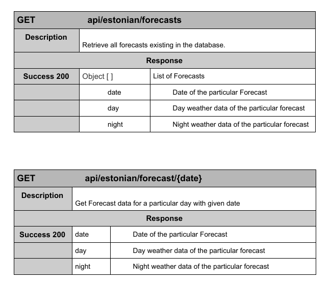

# EstonianWeather-Api

Java Spring Boot based Restful APIs for Weather Forecasts in Estonia.

EstonianWeather-Api exposes a REST-API that can be called and integrated from any front-end application. To that end, we present our REST-APIs in Table 1, which captures the endpoint or URI, and a brief description of the API.

BaseURL<strong>: https://estonianweather-api.herokuapp.com</strong>

## Technologies Used

- Java 8

- Java SpringBoot

- Maven

### Project Structure and Layers

The project follows a Domain Driven Project File Structure in accordance with the conventions of modern web-development.

### How to run locally and Run RestController Tests?

1. Clone this repository
2. Open the Project with IntelliJ (**Java8 installation is a requirement**)
3. Make sure all dependencies are fulfilled through build.gradle
4. Run the Application by running [WeatherserviceApplication.java]()
5. Run the tests by running [ForecastRestControllerTest.java]()

